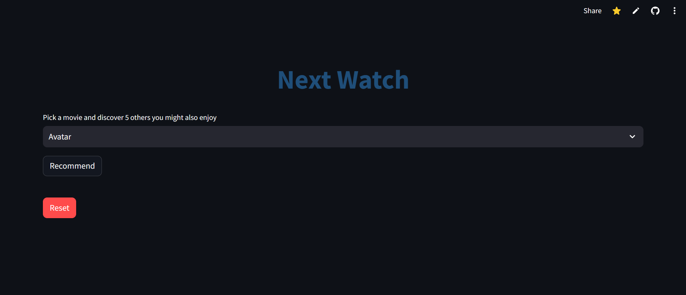
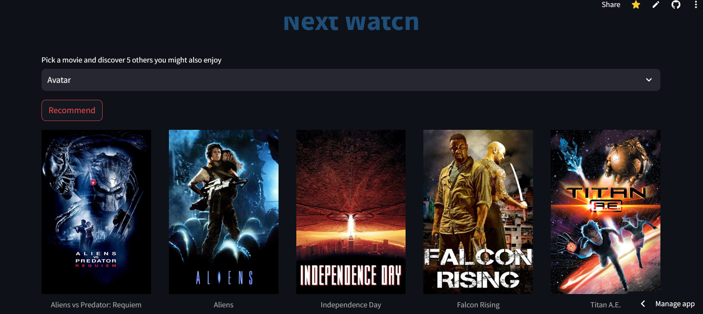
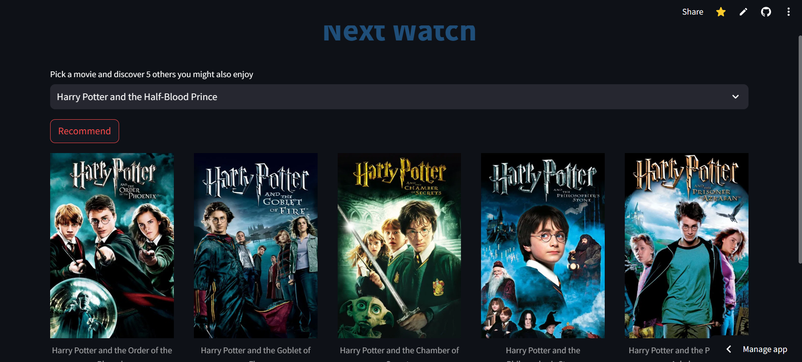

## Movie-Recommender  

  
 
 

This project is a Movie Recommender System built using machine learning techniques. It helps users discover movies tailored to their preferences by analyzing their selected films and suggesting similar ones. The recommender leverages Natural Language Processing (NLP) and count vectorizer to process movie metadata and generates personalized movie suggestions based on the content similarity(cosine similarity).

#### Links

- [Streamlit App](https://next-watch.streamlit.app/)

